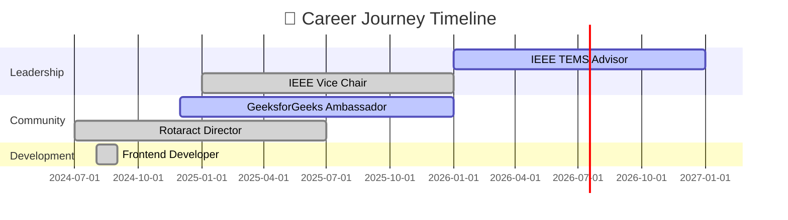

<div align="center">

# ⚔️ WELCOME TO MY REALM ⚔️


</div>

## 🎮 PLAYER STATS

<div align="center">

```ascii
┏━━━━━━━━━━━━━━━━━━━━━━━━━━━━━━━━━━━━━━━━━━━━━━━━━━━━━━━━━━━━━━━━━┓
┃                                                                   ┃
┃   ╔════════════════════════════════════════════════════════╗     ┃
┃   ║  👤 PLAYER: Aditya Tiwari                              ║     ┃
┃   ║  📍 LOCATION: Indore, India                            ║     ┃
┃   ║  🎓 CLASS: BTech CSIT (2023-2027)                      ║     ┃
┃   ║  ⭐ LEVEL: 99                                          ║     ┃
┃   ║  💎 XP: 7.08 CGPA                                      ║     ┃
┃   ║  🏆 RANK: Elite Developer                              ║     ┃
┃   ╚════════════════════════════════════════════════════════╝     ┃
┃                                                                   ┃
┗━━━━━━━━━━━━━━━━━━━━━━━━━━━━━━━━━━━━━━━━━━━━━━━━━━━━━━━━━━━━━━━━━┛
```

</div>

<div align="center">

### ⚔️ COMBAT STATS ⚔️

| 💪 STRENGTH | 🎯 ACCURACY | ⚡ SPEED | 🛡️ DEFENSE | 🧠 INTELLIGENCE |
|:-----------:|:-----------:|:-------:|:----------:|:---------------:|
|  |  |  |  |  |
| **Coding** | **AI/ML** | **Deploy** | **Debug** | **Problem Solving** |

</div>

<div align="center">


</div>

## 🏆 ACHIEVEMENT SHOWCASE

<div align="center">


</div>

<details open>
<summary><b>🎯 QUEST COMPLETION LOG</b></summary>

<br/>

```yaml
╔═══════════════════════════════════════════════════════════════╗
║                    🏆 HACKATHON BATTLES 🏆                   ║
╠═══════════════════════════════════════════════════════════════╣
║  ⚔️  Total Battles Entered        : 7+                        ║
║  🥇 Victories Claimed             : 5                         ║
║  🏅 Championship Titles           :                           ║
║     • AI Fusion Hackathon         : 🥇 WINNER                ║
║     • Hackathon 2.0 (MoTA) GOvernment : 🥇 WINNER            ║
║     • Innovik 5.0                 : 🥈 1st RUNNER UP         ║
║     • Eureka Ideathon             : 🥇 WINNER                ║
║     • Mediverse Hackathon         : 🥈 1st RUNNER UP         ║
║  🎪 SIH 2025                      : 🎯 FINALIST              ║
╠═══════════════════════════════════════════════════════════════╣
║                   📚 RESEARCH MASTERY 📚                      ║
╠═══════════════════════════════════════════════════════════════╣
║  📄 Papers Published              : 4                         ║
║  🏆 Best Research Awards          : 2                         ║
║     • NSSAFE 2025                 : ⭐ BEST PAPER           ║
║     • IEEE Ignite 2025            : ⭐ BEST PAPER           ║
╠═══════════════════════════════════════════════════════════════╣
║                  🏛️ GOVERNMENT MISSIONS 🏛️                   ║
╠═══════════════════════════════════════════════════════════════╣
║  🇮🇳 Press Release Features        : 3x                       ║
║  🤝 Active Gov Projects           : 2 (Min. Tribal Affairs)  ║
║  🎯 Impact                        : National Level           ║
╚═══════════════════════════════════════════════════════════════╝
```

</details>

<div align="center">


</div>

<div align="center">


</div>

## 💼 EXPERIENCE TIMELINE

<div align="center">



</div>

<details open>
<summary><b>🎖️ LEADERSHIP ROLES</b></summary>

<br/>

<div align="center">

| 🎯 POSITION | 🏢 ORGANIZATION | 📅 PERIOD | ⚡ STATUS |
|:------------|:----------------|:----------|:--------:|
| 🎓 **Advisor** | IEEE TEMS Student Branch Chapter | Jan 2026 - Present | 🟢 ACTIVE |
| 👑 **Vice Chair** | IEEE Student Branch AITR | Jan 2025 - Jan 2026 | ✅ COMPLETED |
| 🌍 **International Service Director** | Rotaract Club Acropolis Royals | Jul 2024 - Jul 2025 | ✅ COMPLETED |
| 🚀 **Campus Ambassador** | GeeksforGeeks | Dec 2024 - Jan 2026 | 🟢 ACTIVE |
| 💻 **Frontend Developer** | Fast and Right Services | Aug 2024 - Sep 2024 | ✅ COMPLETED |

</div>

</details>

<div align="center">


</div>

## 🛠️ TECH ARSENAL & WEAPONS

<div align="center">


</div>

<details open>
<summary><b>💻 PRIMARY WEAPONS</b></summary>

<br/>

<div align="center">

### ⚔️ OFFENSIVE ARSENAL


### 🎨 FRONTEND MAGIC


### ⚙️ BACKEND FORTRESS


### 🗄️ DATABASE VAULT


### 🤖 AI/ML SPELLS


### ☁️ CLOUD & DEVOPS


</div>

</details>

<div align="center">


</div>

## 📊 BATTLE STATISTICS

<div align="center">


<br/><br/>


<br/><br/>


<br/><br/>


</div>

<div align="center">


</div>

## 🎯 LEGENDARY QUESTS (PROJECTS)

<div align="center">


</div>

### 🏛️ **[QUEST 01] ASTITAVA & NyayaSetu**
```diff
+ STATUS: 🟢 IN PROGRESS | DIFFICULTY: ⭐⭐⭐⭐⭐ LEGENDARY
```

<div align="center">


</div>

**🎯 MISSION:** Forest governance digitization platform for tribal communities  
**🏢 CLIENT:** Ministry of Tribal Affairs, Government of India  
**⚔️ WEAPONS USED:** OCR, Named Entity Recognition, WebGIS, React, Decision Support System  
**💎 REWARD:** National Impact | Government Recognition  
**📜 DESCRIPTION:** Engineered dual-platform ecosystem digitizing forest rights documents into centralized FRA Atlas database with analytics dashboard for policy makers.

---

### 🏥 **[QUEST 02] HealthSaarthi** 
```diff
+ STATUS: ✅ COMPLETED | DIFFICULTY: ⭐⭐⭐⭐⭐ LEGENDARY
+ ACHIEVEMENT UNLOCKED: 🏆 HACKATHON WINNER
```

<div align="center">


</div>

**🎯 MISSION:** Create unified healthcare ecosystem  
**⚔️ WEAPONS USED:** OpenCV, YOLOv8, Vapi SDK, React, Three.js, BLE  
**💎 REWARD:** 🥇 First Prize - AI Fusion Hackathon  
**📜 DESCRIPTION:** Comprehensive platform with AI disease prediction, telemedicine, emergency alerts, multi-lingual chatbot, and real-time health monitoring.

**✨ SPECIAL ABILITIES:**
- 🤖 AI Disease Detection using Machine Learning
- 🚨 Smart Emergency System with live tracking
- 💬 Multi-lingual Voice Bot (Agentic AI)
- ⌚ IoT Wearable Integration via BLE
- 🧘 YOLOv8 Exercise Guidance System

**🔗 [View Quest Details](https://github.com/adityatiwari12/health-saarthi)**

---

### 🚦 **[QUEST 03] GatiSense**
```diff
+ STATUS: ✅ COMPLETED | DIFFICULTY: ⭐⭐⭐⭐ EPIC
```

<div align="center">


</div>

**🎯 MISSION:** Intelligent traffic monitoring system  
**⚔️ WEAPONS USED:** YOLOv8, OpenCV, Python, Computer Vision  
**💎 STATS:** 96% Accuracy | 30+ FPS | Real-time Processing  
**📜 DESCRIPTION:** Real-time traffic density estimation with automated congestion alerts and comprehensive analytics dashboard.

**🔗 [View Quest Details](https://github.com/adityatiwari12/GatiSense)**

---

### 🔍 **[QUEST 04] AnveshanAI**
```diff
+ STATUS: ✅ COMPLETED | DIFFICULTY: ⭐⭐⭐⭐ EPIC
```

<div align="center">


</div>

**🎯 MISSION:** Lost & found person identification  
**⚔️ WEAPONS USED:** Face Recognition, KD-Tree, Socket.io, React, Flask  
**💎 REWARD:** Social Impact | Community Service  
**📜 DESCRIPTION:** AI-powered facial recognition system to reunite missing persons with families using advanced encoding and KD-Tree searches.

**🔗 [View Quest Details](https://github.com/adityatiwari12/AnveshanAI)**

---

### 💊 **[QUEST 05] Medicine Recommendation System**
```diff
+ STATUS: ✅ COMPLETED | DIFFICULTY: ⭐⭐⭐ RARE
```

<div align="center">


</div>

**🎯 MISSION:** Smart healthcare medication assistant  
**⚔️ WEAPONS USED:** BERT, spaCy, NLTK, K-Means, React  
**💎 FEATURES:** Medicine alternatives, symptom lookup, side effects, dosage recommendations  

---

### 🎓 **[QUEST 06] VidyarthiAI**
```diff
+ STATUS: ✅ COMPLETED | DIFFICULTY: ⭐⭐⭐ RARE
```

**🎯 MISSION:** AI-powered student learning assistant  
**⚔️ WEAPONS USED:** TypeScript, React, AI Integration  
**💎 REWARD:** Educational Impact  

**🔗 [View Quest Details](https://github.com/adityatiwari12/Vidyarthi-AI)**

<div align="center">


</div>

## 📚 RESEARCH SCROLLS

<div align="center">


</div>

<details open>
<summary><b>📜 PUBLISHED MANUSCRIPTS</b></summary>

<br/>

### 🔬 **K-dimensional Trees for Efficient Face Detection**
```yaml
📅 Publication: TechRxiv (Preprint) 2025
🏆 Achievement: Best Research Paper Award
⚡ Impact: Reduced complexity from O(n) to O(log n)
🎯 Field: Computer Vision, Algorithm Optimization
```

**BREAKTHROUGH:** Optimized face detection using K-d trees for nearest neighbor searches, demonstrating significant computational efficiency improvement in matching phase.

**🔗 [Read Paper](https://doi.org/10.36227/techrxiv.174803737.71813266/v1)**

---

### 🌱 **Integrating Renewable Energy into ASIC-based Crypto Mining**
```yaml
📅 Publication: ICI3-2024 Conference
🏆 Achievement: Published Research
⚡ Impact: Sustainable Blockchain Solutions
🎯 Field: Renewable Energy, Cryptocurrency
```

**INNOVATION:** Explored sustainable cryptocurrency mining through renewable energy integration with ASIC systems, analyzing energy efficiency and environmental impact.

---

### 🏆 **Research Awards**
- ⭐ **Best Research Paper** - NSSAFE 2025
- ⭐ **Best Research Paper** - IEEE Ignite 2025

</details>

<div align="center">


</div>

## 🎯 ACTIVE SKILL TREE

<div align="center">


</div>

```javascript
const currentSkillProgress = {
  mastering: {
    "Data Structures & Algorithms": "████████░░ 80%",
    "System Design": "██████░░░░ 60%",
    "Cloud Architecture": "███████░░░ 70%"
  },
  
  building: {
    "Government Digital Solutions": "█████████░ 90%",
    "Healthcare AI Systems": "████████░░ 80%",
    "Computer Vision Apps": "████████░░ 85%"
  },
  
  exploring: {
    "Generative AI": "██████░░░░ 65%",
    "Deep Learning": "█████░░░░░ 55%",
    "Distributed Systems": "████░░░░░░ 45%"
  },
  
  leading: {
    "IEEE TEMS Chapter": "██████████ 100%",
    "Technical Community": "█████████░ 95%"
  }
};

// 🎯 NEXT LEVEL: Preparing for Software Engineering Roles
// 💡 FOCUS: Building production-grade systems
// 🚀 GOAL: Impact millions through technology
```

<div align="center">


</div>

## 🌐 GUILD COMMUNICATION

<div align="center">


<br/>

[](https://adityatiwariportfolio.vercel.app/)
[](https://linkedin.com/in/adityatiwari08)
[](mailto:adityatiwari8@ieee.org)
[](https://github.com/adityatiwari12)
[](./Aditya_Tiwari_Resume.pdf)
[](tel:+917648935563)

</div>

### 🤝 QUEST COLLABORATIONS

<div align="center">

```ascii
╔════════════════════════════════════════════════════════════════╗
║                                                                ║
║  🎮 LOOKING FOR CO-OP PLAYERS:                                ║
║                                                                ║
║  ⚔️  Full-Stack Development Raids                            ║
║  🤖 AI/ML Research Expeditions                               ║
║  🏥 Healthcare Tech Missions                                 ║
║  🏆 Hackathon Battle Royales                                 ║
║  📚 Technical Documentation Quests                           ║
║  🌍 Open Source Guild Contributions                          ║
║                                                                ║
║  💬 SEND GUILD INVITE: DM me on any platform!                ║
║                                                                ║
╚════════════════════════════════════════════════════════════════╝
```

</div>

<div align="center">


</div>

## 🎊 REALM STATISTICS

<div align="center">

```ascii
┏━━━━━━━━━━━━━━━━━━━━━━━━━━━━━━━━━━━━━━━━━━━━━━━━━━━━━━━━━━━━━━┓
┃                                                                ┃
┃   👥 Visitors to Realm    : [Profile Views Counter]           ┃
┃   ⭐ Reputation Points     : [GitHub Stars]                    ┃
┃   🤝 Guild Members         : [Followers]                       ┃
┃   🔥 Activity Level        : LEGENDARY                         ┃
┃                                                                ┃
┗━━━━━━━━━━━━━━━━━━━━━━━━━━━━━━━━━━━━━━━━━━━━━━━━━━━━━━━━━━━━━━┛
```

<br/>


</div>

<div align="center">


</div>

<div align="center">


```ascii
╔════════════════════════════════════════════════════════════════╗
║                                                                ║
║              "Building solutions that matter,                  ║
║               one commit at a time."                          ║
║                                                                ║
║              - Aditya Tiwari, Code Warrior                    ║
║                                                                ║
╚════════════════════════════════════════════════════════════════╝
```


<br/><br/>

**Made with ⚡ by a passionate developer who loves gaming aesthetics**

</div>
