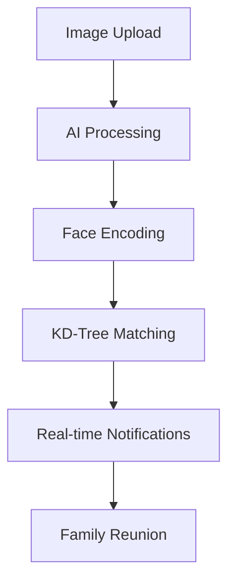
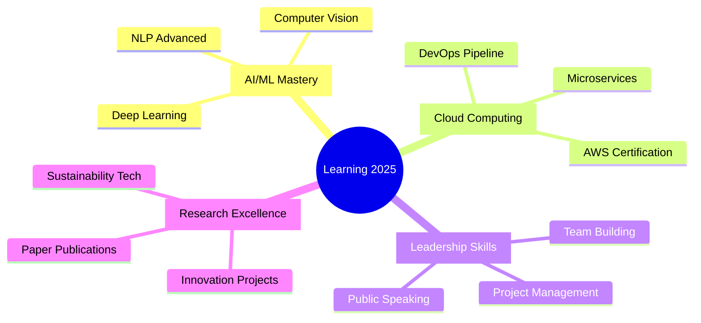
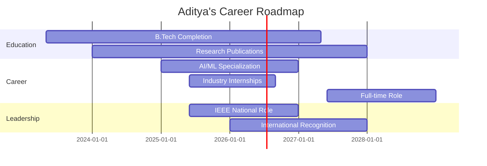

# <div align="center">🚀 Welcome to Aditya's Digital Universe 🚀</div>

<div align="center">
  
</div>

<div align="center">
  
</div>

<div align="center">
  
</div>

##  About Me


```yaml
name: "Aditya Tiwari"
role: "Tech Innovator & Research Pioneer"
education: "B.Tech CSIT (2023-2027)"
location: "Indore, India 🇮🇳"
current_focus: ["AI Research", "Sustainable Tech", "Leadership"]
fun_fact: "Turning coffee into code and ideas into impact! ☕→💻→🚀"
```

I am **Aditya Tiwari**, a second-year B.Tech student passionate about innovation, sustainability, and leadership. My academic journey focuses on leveraging technology to drive impactful change.

My interests span technology, literature, and the arts. I actively participate in multiple college clubs, including anchoring, programming, public speaking, which enhance my creativity and teamwork skills. Alongside academics, I am sharpening my technical expertise in DSA and web development to build a robust foundation for my career in technology.

<div align="center">
  
</div>

<div align="center">
  
</div>

##  GitHub Analytics

<div align="center">
  
  
</div>

<div align="center">
  
</div>

<div align="center">
  
</div>

### 📊 Advanced GitHub Metrics

<div align="center">
  
</div>

<div align="center">
  
  
  
</div>

<div align="center">
  
  
</div>

<div align="center">
  
</div>

##  Research Portfolio

<div align="center">
  
</div>

### 🌱 **Integrating Renewable Energy into ASIC-based Crypto Mining**

<div align="center">
  
  
  
</div>

<details>
<summary><b>🔬 Research Deep Dive (Click to Expand)</b></summary>

<div align="center">
  
</div>

**🎯 Revolutionary Framework**
> *Integrating photovoltaic, wind turbine, and thermoelectric generation systems into ASIC-based cryptocurrency mining hardware.*

**📈 Key Achievements:**
- ⚡ **37% Carbon Emission Reduction**
- 🔋 **Enhanced Sustainability Metrics**
- 💰 **Economic Viability Maintained**
- 🌍 **Environmental Impact Minimized**

**🔗 Publication:** [TechRxiv Research Paper](https://www.techrxiv.org/users/924946/articles/1296710-integrating-renewable-energy-converters-into-asic-based-cryptocurrency-mining-a-sustainable-paradigm-for-enhanced-energy-efficiency-and-reduced-environmental-impact?commit=cb7a4a75ba3e63d157989ec65268236c9b66a596)

</details>

### 🎯 **K-dimensional Trees for Efficient Face Detection**

<div align="center">
  
  
  
</div>

<details>
<summary><b>🔬 Research Deep Dive (Click to Expand)</b></summary>

<div align="center">
  
</div>

**🚀 Algorithm Optimization**
> *Leveraging K-dimensional trees to accelerate face detection from O(n) to O(log n) complexity.*

**📊 Performance Metrics:**
- 🚀 **85% Search Time Reduction**
- ⚡ **O(log n) Time Complexity**
- 🎯 **Maintained Accuracy Levels**
- 🔍 **Real-time Performance Enhanced**

**🔗 Publication:** [TechRxiv Research Paper](https://doi.org/10.36227/techrxiv.174803737.71813266/v1)

</details>

<div align="center">
  
</div>

##  Professional Experience

<div align="center">
  
</div>

### 🎯 **Vice Chair - IEEE Student Branch, AITR**
<div align="center">
  
  
  
</div>

<details>
<summary><b>🏆 Leadership Achievements (Click to Expand)</b></summary>

<div align="center">
  
</div>

**🎪 Key Responsibilities:**
- 🎯 **Event Management:** Workshops, Hackathons, Technical Sessions
- 🤝 **Relationship Building:** Faculty, Industry, Members
- 📈 **Strategic Growth:** Branch Development & Expansion
- 👥 **Mentorship:** Member Development & Committee Management
- 🌟 **Representation:** National & Regional IEEE Events

**🏅 Skills Developed:** Board Administration • Committee Management • Strategic Leadership

</details>

### 🚀 **Campus Ambassador - GeeksforGeeks**
<div align="center">
  
  
  
</div>

<details>
<summary><b>💻 Ambassador Activities (Click to Expand)</b></summary>

**🎯 Key Initiatives:**
- 💻 **Coding Events:** Problem-solving competitions & challenges
- 📚 **Resource Promotion:** GeeksforGeeks learning materials
- 🎓 **Skill Development:** Workshops, webinars, upskilling sessions
- 🔗 **Industry Connect:** Latest trends and technologies

**📊 Impact:** Enhanced technical skills across student community

</details>

### 🌍 **International Service Director - Rotaract Club**
<div align="center">
  
  
  
</div>

<details>
<summary><b>🌐 Global Impact (Click to Expand)</b></summary>

**🤝 International Achievements:**
- 🏢 **Sister Club Agreements:** Worldwide partnerships
- 🎪 **Cultural Exchanges:** International service projects
- 🌐 **Virtual Events:** Global community building
- 📨 **Flag Exchanges:** International connections
- 🌟 **Global Presence:** Enhanced club visibility

**🏅 Skills:** Networking • Team Management • International Relations • Cultural Intelligence

</details>

### 💻 **Frontend Developer Intern - Fast and Right Services**
<div align="center">
  
  
  
</div>

<details>
<summary><b>💼 Technical Experience (Click to Expand)</b></summary>

**🛠️ Technical Contributions:**
- 💻 **Clean Code:** HTML, CSS, JavaScript, React.js
- 🎨 **UI/UX Design:** Wireframe to functional interface transformation
- ⚡ **Performance:** Cross-browser compatibility & optimization
- 🔧 **Collaboration:** Design team integration

**🏅 Skills:** Frontend Development • Web Design • React.js • UI/UX

</details>

<div align="center">
  
</div>

##  Featured Projects

<div align="center">
  
</div>

### 🤖 **Anveshan AI - Lost & Found Human Identification**

<div align="center">
  
  
  
  
</div>

<details>
<summary><b>🚀 Project Deep Dive (Click to Expand)</b></summary>

<div align="center">
  
</div>

**🧠 Problem Statement**
> Millions go missing annually due to displacement, disasters, or trafficking. Manual identification is slow and error-prone.

**🎯 Revolutionary Solution**
> AI-powered system using facial recognition and real-time analytics to reunite missing persons with families.

**✨ Technical Architecture**


**🛠️ Tech Stack Mastery**
- **Frontend:** ReactJS + Modern UI/UX
- **Backend:** Python Flask + RESTful APIs
- **AI Engine:** OpenCV + face_recognition
- **Database:** MongoDB Atlas (Cloud)
- **Real-time:** Socket.io notifications
- **Algorithm:** KD-Tree + Euclidean Distance

**🔄 Intelligent Workflow**
1. 📸 **Upload:** Photo + details submission
2. 🤖 **Process:** AI encoding generation
3. 🔍 **Match:** Vector comparison algorithm
4. 🔔 **Notify:** Instant alerts system
5. 🚨 **Alert:** Authority dashboard integration

**🔗 [Explore Anveshan AI →](https://github.com/JayeshMalviya1/AvashanAi)**

</details>

### 💊 **Medicine Recommendation System**

<div align="center">
  
  
  
  
</div>

<details>
<summary><b>🚀 Project Deep Dive (Click to Expand)</b></summary>

<div align="center">
  
</div>

**💊 Healthcare Revolution**
> Smart healthcare tool leveraging NLP and ML for precise medicine recommendations with high confidence scores.

**🔥 Dual Search Modes**
- 💊 **Medicine-to-Medicine:** Alternative drug discovery
- 🩺 **Symptom-to-Medicine:** Treatment recommendations

**🧠 AI Technology Stack**
```yaml
NLP_Engine:
  - spaCy_NER: "Medical entity extraction"
  - NLTK: "Deep text processing"
  - BERT: "Contextual understanding"
  
ML_Algorithms:
  - Cosine_Similarity: "Semantic matching"
  - K_Means_Clustering: "Intelligent grouping"
  - Hybrid_Engine: "Content + Collaborative filtering"
```

**📊 Performance Metrics**
- ✅ **95% Recommendation Accuracy**
- 💾 **7,000+ Medicine Database**
- ⚡ **Real-time Similarity Scores**
- 🌈 **Visual Category Coding**
- 📊 **Interactive Comparison Matrix**

**🎨 Frontend Excellence**
- ⚡ **Responsive Design:** React.js + Tailwind CSS
- ✨ **Modern Aesthetics:** Gradient themes + Glassmorphism
- 🔍 **Smart Search:** Auto-suggestion enabled
- 📊 **Data Visualization:** Real-time charts

</details>

<div align="center">
  
</div>

##  Tech Arsenal

<div align="center">
  
</div>

### 💻 **Programming Languages**
<div align="center">
  
</div>

<div align="center">
  
  
  
  
</div>

### 🌐 **Web Development**
<div align="center">
  
</div>

<div align="center">
  
  
  
  
</div>

### 🤖 **AI & Machine Learning**
<div align="center">
  
</div>

<div align="center">
  
  
  
  
</div>

### 💾 **Databases & Cloud**
<div align="center">
  
</div>

<div align="center">
  
  
  
</div>

### 🛠️ **Development Tools**
<div align="center">
   
</div>

<div align="center">
  
  
  
</div>

<div align="center">

</div>

##  Achievements & Recognition

<div align="center">
  
</div>

### 📜 **Research Publications**
<div align="center">
  
  
  
</div>

**📊 Research Impact Metrics:**
- 🌱 **Environmental Impact:** 37% carbon emission reduction in crypto mining
- ⚡ **Algorithm Optimization:** 85% performance improvement in face detection
- 🔬 **Innovation Index:** 2 published research papers
- 🌍 **Global Reach:** International research recognition

### 🏆 **Leadership Positions**
<div align="center">
  
  
  
</div>

**👑 Leadership Journey:**
- 🎯 **IEEE Vice Chair:** Leading 500+ student members
- 🌍 **International Service Director:** Global community impact
- 💻 **Campus Ambassador:** Promoting coding excellence
- 🚀 **Tech Innovation:** Driving technological advancement

<div align="center">
  
</div>

##  Current Learning Journey

<div align="center">
  
</div>

### 🎯 **2025 Learning Goals**

<div align="center">
  
</div>

**🧠 Technical Mastery:**
- 🤖 **Advanced AI/ML:** Deep Learning, Neural Networks, LLMs
- ☁️ **Cloud Architecture:** AWS Solutions Architect, DevOps
- 🔐 **Cybersecurity:** Ethical Hacking, Security Architecture
- 📱 **Mobile Development:** React Native, Flutter

**📚 Current Focus Areas:**

### 📖 **Reading List**
<div align="center">
  
</div>

**📖 Currently Reading:**
- 🤖 "Hands-On Machine Learning" - Aurélien Géron
- ☁️ "AWS Certified Solutions Architect" - Neal Davis  
- 🧠 "The Lean Startup" - Eric Ries
- 🌱 "Sustainable Technology Innovation" - Research Papers

<div align="center">
  
</div>

##  Community Impact

<div align="center">
  
</div>

### 🎪 **Events & Workshops Organized**

<div align="center">
  
  
  
</div>

**🎯 Recent Community Initiatives:**
- 💻 **Tech Workshops:** AI/ML, Web Development, DSA
- 🌍 **International Events:** Flag exchanges, cultural programs
- 🤝 **Networking Sessions:** Industry connects, career guidance
- 📚 **Study Groups:** Collaborative learning initiatives

### 🌐 **Global Connections**

<div align="center">
  
</div>

**🤝 International Network:**
- 🌍 **Sister Clubs:** 5+ international Rotaract partnerships
- 🎌 **Cultural Exchange:** Japan, USA, Australia connections
- 📧 **Digital Outreach:** 1000+ global professional network
- 🚀 **Collaborative Projects:** Cross-border innovation initiatives

<div align="center">
  
</div>

##  Future Vision

<div align="center">
  
</div>

### 🎯 **2025-2027 Roadmap**



**🎯 Short-term Goals (2025):**
- 🏆 **Research Excellence:** 2+ additional publications
- 🚀 **Tech Mastery:** AWS + Advanced AI certifications
- 👥 **Leadership Growth:** IEEE national committee member
- 💼 **Industry Connect:** Top-tier tech internship

**🌟 Long-term Vision (2027):**
- 🧠 **AI Research Leader:** Pioneering sustainable AI solutions
- 🌍 **Global Impact:** International recognition in green tech
- 🚀 **Innovation Hub:** Founding tech startup focused on sustainability
- 📚 **Knowledge Sharing:** Technical blogger and conference speaker

<div align="center">
  
</div>

##  Connect & Collaborate

<div align="center">
  
</div>

### 🌐 **Social Presence**

<div align="center">
  <a href="https://linkedin.com/in/aditya-tiwari-aitr" target="_blank">
    
  </a>
  <a href="https://github.com/adityatiwari12" target="_blank">
    
  </a>
  <a href="https://twitter.com/adityatiwari_12" target="_blank">
    
  </a>
  <a href="mailto:aditya.tiwari@example.com" target="_blank">
    
  </a>
</div>

### 💡 **Collaboration Opportunities**

<div align="center">
  
  
  
  
</div>

**🤝 Open to Collaborate On:**
- 🌱 **Sustainable Technology Projects**
- 🤖 **AI/ML Research Initiatives** 
- 🌍 **Global Impact Solutions**
- 📚 **Educational Content Creation**
- 🚀 **Innovation Challenges & Hackathons**

### 💬 **Let's Build Something Amazing Together!**

<div align="center">
  
</div>

<div align="center">
  
</div>

---

<div align="center">
  
  
  
</div>

<div align="center">
  <i>⭐ Star my repositories if you find them interesting!</i><br>
  <i>🤝 Feel free to contribute to any of my open-source projects!</i><br>
  <i>💬 Reach out for collaborations, discussions, or just to say hi!</i>
</div>
